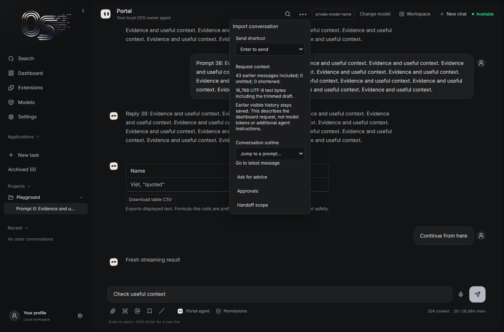
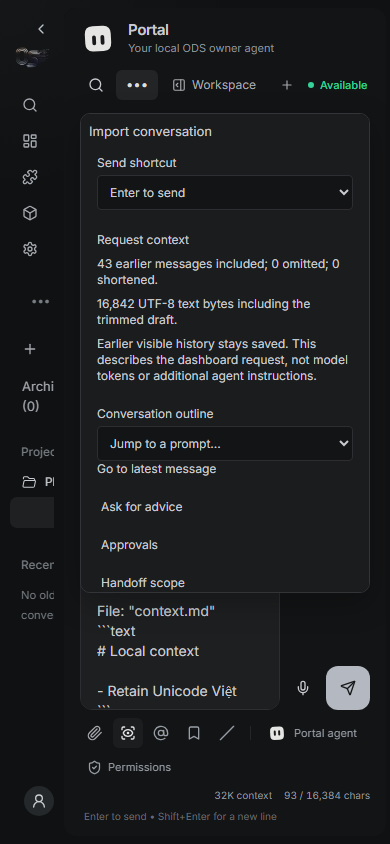
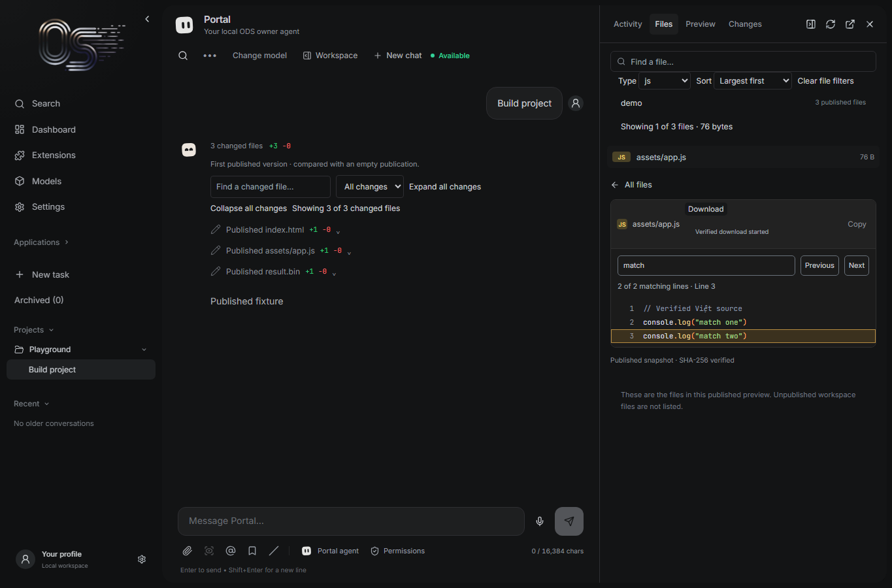
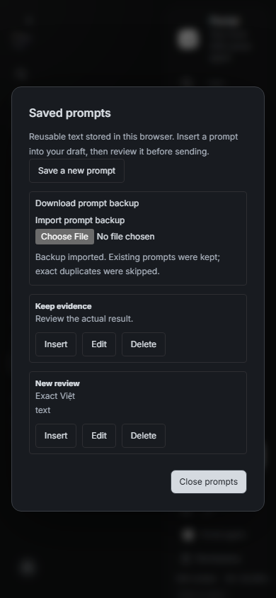

# Public-beta feature batch — 2026-09-11

Twenty independently scoped author PRs target `Osmantic/ODS:public-beta`. Upstream has merged the first 15; five remain open. The author did not merge or deploy them. Monthly author search: tang-vu 120, vaibhavsrv 93 (lead 27); 451 tang-vu PRs remain open, an advisory review/triage backlog.

## Exact integration candidate

- Original base: `d7d76cdc`; upstream base after resuming: `d8f8c89b`.
- Tested combined code head: [`25339b15f0be76dd7887551a68c3568d5828b14f`](https://github.com/tang-vu/DreamServer/commit/25339b15f0be76dd7887551a68c3568d5828b14f). This receipt and fixture artifacts are added afterward without changing production code.
- Fork branch: `integration/beta-feature-batch-20260911`. No additional upstream PR is created for the receipt.
- Every first-15 exact PR head is an ancestor of the upstream base. Start there, then merge #4217 → #4218 → #4219 → #4220 → #4221, followed by #4220's mobile follow-up `81282453`.
- Two textual conflicts occurred: adjacent imports in `Pixel.jsx` when combining #4218/#4219 and then #4220. Keep all imports. History selection, CSV rendering and scroll ownership compose without changing their independent contracts. The integration branch records the resolutions.
- Upstream compatibility is included: #4119 conversation exports, #4107 clipboard receipts, #4116 source fidelity, retained-history fixes and search keyboard/lifecycle fixes are present in the latest base.
- Upstream subsequently removed #4144's message copy/reuse controls in workspace-polish commit `cfd58cb2` (#4207). The submitted feature was merged, but those controls are deliberately not reinstated here. Submitted PR work and current product behavior are distinguished.

## Validation on the combined candidate

Windows x64 dashboard, Node 20 (the CI major), final code head above:

```text
npm exec --yes --package=node@20 -- node node_modules/vitest/vitest.mjs run --maxWorkers=4
106 files passed; 898 tests passed; 0 failed (111.51 s).
npx eslint src --quiet: passed.
npm run build: passed.
git diff --check and changed-file pre-commit: passed.
```

Ordinary ESLint retains existing JSX warnings. The first combined suite at `efc2f63a` also passed 898 tests. Chromium then found Chat options at x = -62 px on a 390 px viewport. Follow-up `81282453` anchors the menu to the chat header at narrow container widths and bounds its vertical scroll. Focused + affected tests (78), build, browser checks and the final full suite were rerun.

### Browser evidence

Playwright 1.63.0 / Chromium, real Vite dashboard route, Windows x64, 1365×900 desktop and 390×844 mobile. Fixtures supply API/stream/snapshot replies; these checks do not prove installed inference, host publishing or hardware behavior. The only chat mutation in the main scenario was the explicitly submitted prompt. Zero page errors.

- [Main scenario](beta-feature-batch-20260911/batch-smoke.mjs): actual CSV bytes/formula escaping; streaming reading position stays 300 → 300 px; explicit jump ends 0 px from bottom; search finds the new retained reply; prompt JSON round trip without changing the draft; text-file insertion; Markdown preview; diagnostic allowlist; mobile bounds.
- [Files/change review](beta-feature-batch-20260911/files-smoke.mjs): verified source search/next-line, type/size ordering, byte-exact text and binary downloads, changed-file filtering and expand/collapse together.
- [Responsive preview](beta-feature-batch-20260911/viewport-smoke.mjs): actual iframe 375×667; application counter survives resize and rotation.
- [Conversation import](beta-feature-batch-20260911/import-smoke.mjs): original history retained, fresh identity, text/draft preserved, no chat submission.
- [Organizer](beta-feature-batch-20260911/organizer-smoke.mjs): rename/pin; action and title rectangles do not overlap. Updated the old browser assertion for upstream moving the organizer to the right; no production fix was needed.

| Desktop | Mobile |
|---|---|
|  |  |
|  |  |

Additional screenshots: [change review](beta-feature-batch-20260911/batch-change-review.png), [responsive preview](beta-feature-batch-20260911/viewport-desktop.png), [import](beta-feature-batch-20260911/import-desktop.png), [organizer](beta-feature-batch-20260911/organizer-desktop.png), [draft preview](beta-feature-batch-20260911/batch-composer-mobile.png), [diagnostics](beta-feature-batch-20260911/batch-diagnostics-mobile.png). Private-model/secret strings in fixtures are invented sentinels, not owner data.

To reproduce: start the dashboard at the tested commit on port 4319; copy the five scripts into a disposable directory; run `npm install --no-save playwright@1.63.0` and `npx playwright install chromium` there, then `node batch-smoke.mjs` and the remaining scripts. `BASE_URL` overrides the default origin; screenshots are written alongside scripts. The portable main/files copies were executed successfully after removing workstation-specific paths.

## Negative gates and limits

- **#4218 is not merge-ready while its failed upstream check remains unresolved.** [pixel-inference-contracts (3.11)](https://github.com/Osmantic/ODS/actions/runs/34551692715/job/103115764103): 783 passed, one failure in `test_parent_loss_reaps_installer_descendants_and_keeps_slot_until_exit[supervisor-sigkill]`. Reading `/proc/<pid>/stat` raised `ProcessLookupError` while the process exited. CSV/dashboard tests passed; the PR does not touch this Python fixture or runtime. GitHub rejected the failed-job rerun: “Must have admin rights to Repository.” A maintainer must rerun or address the canonical fixture. No empty commit or close/reopen was used to manufacture a green receipt.
- Full `make gate` on a native Linux clone of this head under WSL/root passed lint and preceding contracts, then stopped at `test-phase03-multigpu-tty.sh`: 3 pass / 2 fail (no-sudo Docker fallback promoted/invoked sudo). This also occurred on the original baseline.
- Separately, BATS: **416/421 pass**. Failures: `dispatch.bats` detects the actual WSL kernel; `path-utils.bats` sees root/15 GB free and exits 2 instead of 1; three `preflight-phase.bats` fixtures reject root. These files and the phase03 fixture are byte-unchanged from `d7d76cdc`. No ordinary WSL user is configured; no host accounts or permissions were altered to hide these conditions.
- `make smoke`: all four Linux AMD/NVIDIA, WSL and macOS dispatch/compose smoke paths pass.
- `make simulate` exits 0, **but its report is not wholly green**: Linux NVIDIA fails because dry-run preflight rejects root and required signals are absent. Windows WSL2 NVIDIA, Windows WSL2 AMD and Apple Silicon simulated paths pass. Simulation is not installation evidence.
- Original full pre-commit flags existing literal `unit-test-key` fixtures in dashboard-api host-agent and remote-provider-egress tests. Gitleaks/changed-file hooks pass; no actual key is added.
- No physical GPU, installed inference fleet, fresh install, remote endpoint, restart/update/reinstall or deployment qualification is claimed. CI and fixtures do not waive human review.

## State and rollback

Each PR uses existing frontend authenticated reads, storage boundaries and explicit draft insertion/confirmation. Downloads are local. Prompt imports merge against current storage before one write; conversation imports allocate fresh IDs; neither replays imported work. Boundary tests exercise error states, cancellation/unmount and storage conflicts/corruption.

Review each independent PR with the integration order above. Revert a feature PR to remove its controls; retained browser conversations/prompts remain compatible. Organizer metadata is additive and can remain unused after revert. The synthetic branch is not deployed.

## PR inventory and final heads

| # | Scope | Exact author head | State / checks |
|---|---|---|---|
| 1. [#4139](https://github.com/Osmantic/ODS/pull/4139) | feat(pixel): download verified published files | [e8b3c3f3](https://github.com/tang-vu/DreamServer/commit/e8b3c3f3fbeebff2f61d5a8311e99c1f25c90d2b) | merged; 32 pass, 4 skip, 0 fail |
| 2. [#4140](https://github.com/Osmantic/ODS/pull/4140) | feat(pixel): add bounded text-file input to the composer | [4de76884](https://github.com/tang-vu/DreamServer/commit/4de7688459a1659e31aef512cc4687ce7c25a559) | merged; 32 pass, 4 skip, 0 fail |
| 3. [#4141](https://github.com/Osmantic/ODS/pull/4141) | feat(pixel): organize conversations with names pins and archive | [bcaf3daf](https://github.com/tang-vu/DreamServer/commit/bcaf3daf67d4d6cc3f951a2a32e92359394bebf9) | merged; 32 pass, 4 skip, 0 fail |
| 4. [#4142](https://github.com/Osmantic/ODS/pull/4142) | feat(pixel): search retained replies and drafts | [bed14196](https://github.com/tang-vu/DreamServer/commit/bed14196ca6f3626ef6a7c1c89b2ecaed9297077) | merged; 32 pass, 4 skip, 0 fail |
| 5. [#4143](https://github.com/Osmantic/ODS/pull/4143) | feat(pixel): save and reuse personal prompts | [c611570c](https://github.com/tang-vu/DreamServer/commit/c611570c493ca448bd08a45c936dd5e03ccffc86) | merged; 32 pass, 4 skip, 0 fail |
| 6. [#4144](https://github.com/Osmantic/ODS/pull/4144) | feat(pixel): copy original messages and reuse prompts | [93cb0555](https://github.com/tang-vu/DreamServer/commit/93cb05550000bb60e825f49cb8478830a8436e39) | merged; 32 pass, 4 skip, 0 fail |
| 7. [#4145](https://github.com/Osmantic/ODS/pull/4145) | feat(pixel): find matching lines in verified source | [966d19d0](https://github.com/tang-vu/DreamServer/commit/966d19d02874d8826bf91874fcb8733747f0a980) | merged; 32 pass, 4 skip, 0 fail |
| 8. [#4146](https://github.com/Osmantic/ODS/pull/4146) | feat(pixel): filter and sort published file inventories | [4a6a7025](https://github.com/tang-vu/DreamServer/commit/4a6a7025041b8b3a19606c509d100b434a8be34f) | merged; 32 pass, 4 skip, 0 fail |
| 9. [#4147](https://github.com/Osmantic/ODS/pull/4147) | feat(pixel): filter and expand multi-file change reviews | [7e2c9d6d](https://github.com/tang-vu/DreamServer/commit/7e2c9d6d9a5cd9d2d0785ac9cf94d60d2974dac8) | merged; 32 pass, 4 skip, 0 fail |
| 10. [#4148](https://github.com/Osmantic/ODS/pull/4148) | feat(pixel): inspect responsive preview viewports | [16010e17](https://github.com/tang-vu/DreamServer/commit/16010e1715e1644c03c3d603aebd9592ca643b8f) | merged; 32 pass, 4 skip, 0 fail |
| 11. [#4149](https://github.com/Osmantic/ODS/pull/4149) | feat(pixel): import text history as a new local conversation | [477bac31](https://github.com/tang-vu/DreamServer/commit/477bac31fa3c0d2aa8c477e10f56d7ecff6d21af) | merged; 32 pass, 4 skip, 0 fail |
| 12. [#4150](https://github.com/Osmantic/ODS/pull/4150) | feat(pixel): preview Markdown drafts before sending | [dbd3b1cb](https://github.com/tang-vu/DreamServer/commit/dbd3b1cb608fbe85db4f04d35919593e21c99fb3) | merged; 32 pass, 4 skip, 0 fail |
| 13. [#4151](https://github.com/Osmantic/ODS/pull/4151) | feat(pixel): support a modifier-key send preference | [9a95392b](https://github.com/tang-vu/DreamServer/commit/9a95392b55bea25bf5aa92469bd56573d7c8ee1f) | merged; 32 pass, 4 skip, 0 fail |
| 14. [#4152](https://github.com/Osmantic/ODS/pull/4152) | feat(pixel): navigate retained preview publications | [4581bda5](https://github.com/tang-vu/DreamServer/commit/4581bda5336a0347eb20c5d5d3598aef443f5825) | merged; 32 pass, 4 skip, 0 fail |
| 15. [#4154](https://github.com/Osmantic/ODS/pull/4154) | feat(pixel): navigate long conversations by turn | [d91d5204](https://github.com/tang-vu/DreamServer/commit/d91d52040989c3729c5901f386f82fba542ed6e8) | merged; 32 pass, 4 skip, 0 fail |
| 16. [#4217](https://github.com/Osmantic/ODS/pull/4217) | feat(dashboard): download Pixel diagnostic check summaries | [6b2fdaeb](https://github.com/tang-vu/DreamServer/commit/6b2fdaebbe51c9e3d035e3f8b18df08ddab8962a) | open; 32 pass, 4 skip, 0 fail |
| 17. [#4218](https://github.com/Osmantic/ODS/pull/4218) | feat(pixel): export reply tables as CSV | [a13b99ed](https://github.com/tang-vu/DreamServer/commit/a13b99edcf2f4d94af2a63c5c0e9eac7059f9257) | open; 31 pass, 4 skip, 1 fail |
| 18. [#4219](https://github.com/Osmantic/ODS/pull/4219) | fix(pixel): preserve reading position during streaming | [474479ba](https://github.com/tang-vu/DreamServer/commit/474479ba90c6ee275ce9fd04996bfceea6e8d8ab) | open; 32 pass, 4 skip, 0 fail |
| 19. [#4220](https://github.com/Osmantic/ODS/pull/4220) | feat(pixel): inspect actual next-request context selection | [81282453](https://github.com/tang-vu/DreamServer/commit/8128245356208496d1bac3679d86a3b010067e30) | open; 32 pass, 4 skip, 0 fail |
| 20. [#4221](https://github.com/Osmantic/ODS/pull/4221) | feat(pixel): back up and restore saved prompt libraries | [3546a7f3](https://github.com/tang-vu/DreamServer/commit/3546a7f364d22d843659d3e9b3d612092af45914) | open; 32 pass, 4 skip, 0 fail |
